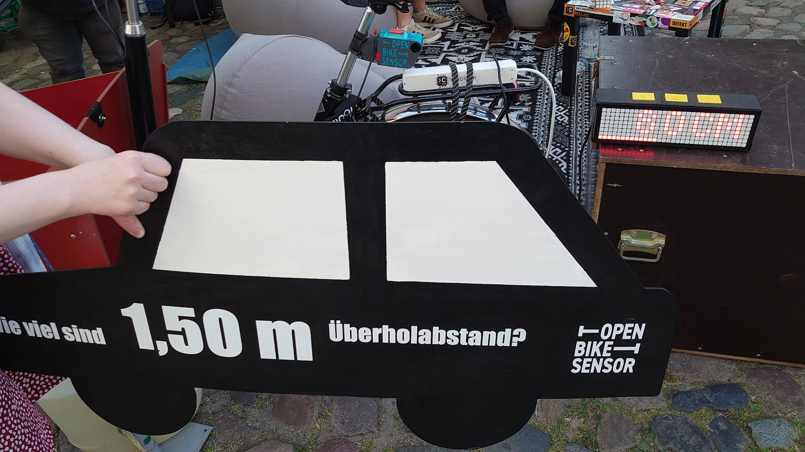
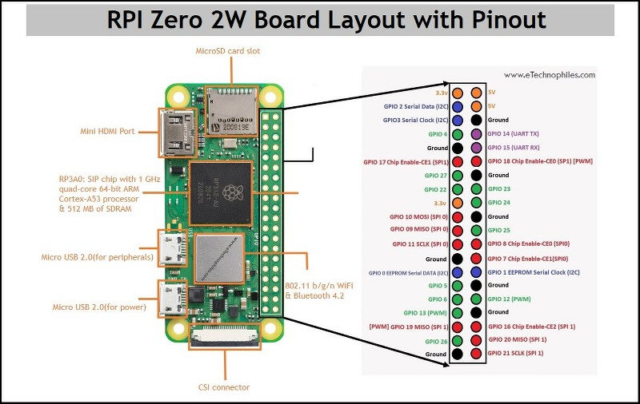
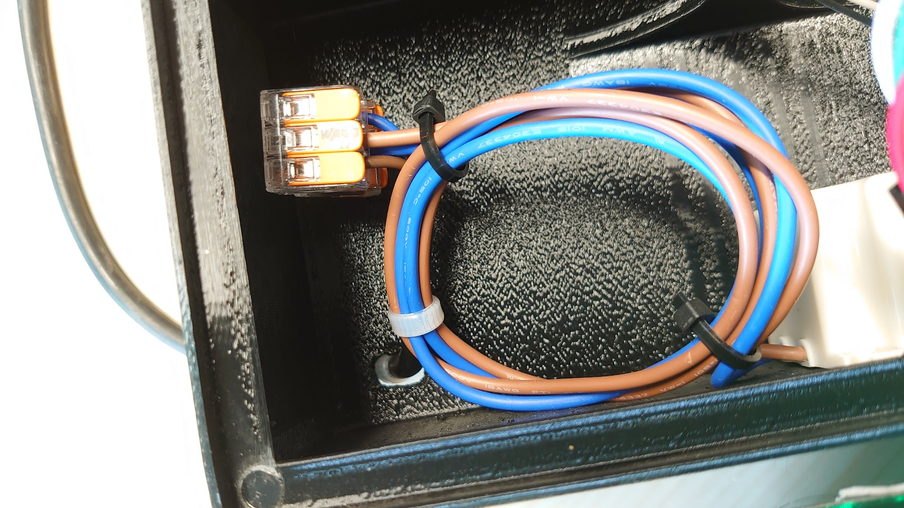
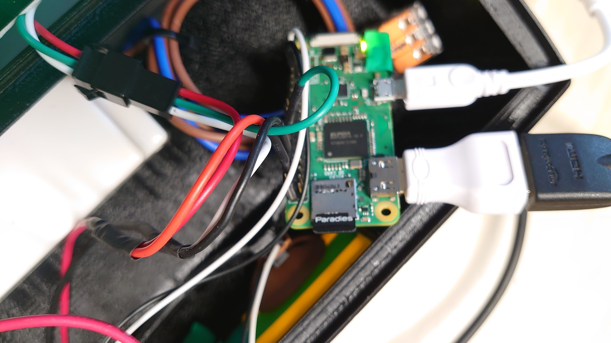
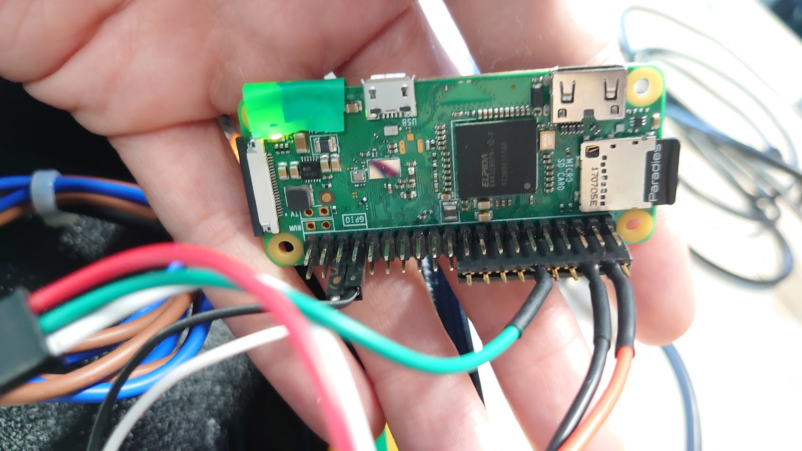
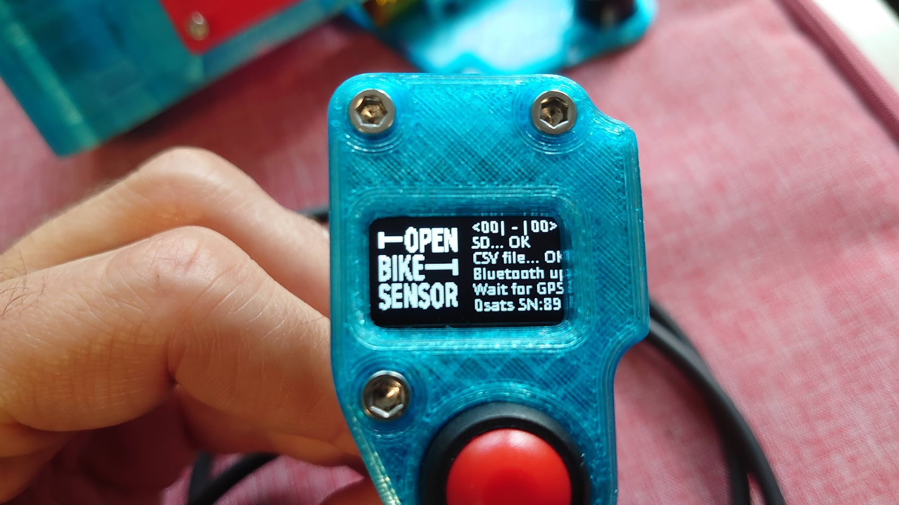
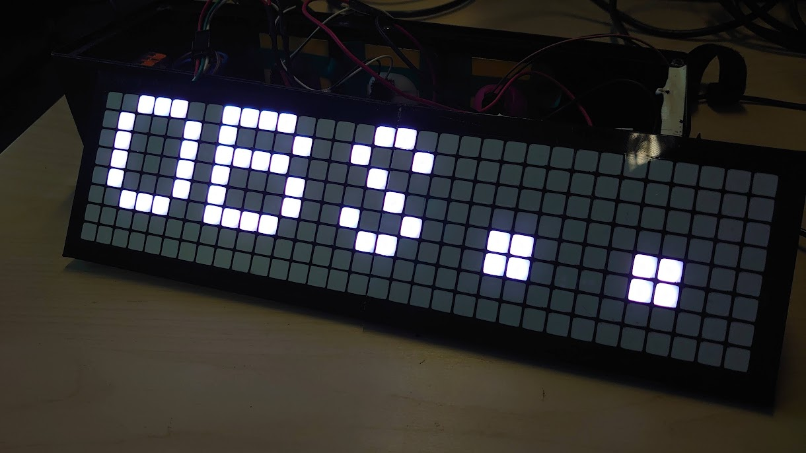
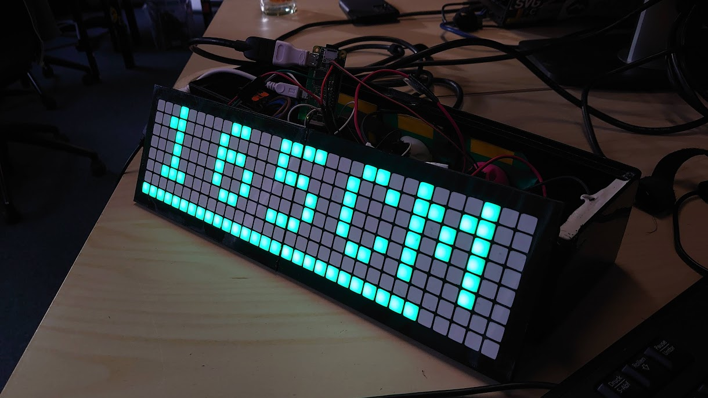

###### tags: `obs` `raspi`

# OBS mit Neopixel-Display am Raspi-Zero

## Motivation

Dieses Dokument beschreibt, wie die Sensorwerte des OBSs auf einer Neopixel-LED-Matrix an einem RasperryPi Zero W angezeigt werden.

> **Warning:**
> Dieses Dokument zeigt (noch) ein 3D-gerucktes Gehäuse. Praktisch sind wir inzwischen 
> bei einem Holzgehäuse angekommen.

> **Warning:**
> Gegenüber früheren Versionen hat sich der standardpin für den Button geändert - Falls du schon ein gerät besitzt musst du ggf. den Button pin in der für dich passenden `.py` Datei anpassen.

### Links

* [Software](../firmware)
* [Gehäuse](../case)

## Benötigtes Material

* Holz-Gehäuse:
    * [hier im Repo](../case)
* Für Pi zero: [pi zero schraubplatte zum einkleben](https://www.printables.com/model/218525-raspberry-pi-zero-pi-plates)
* Alternativ: [Pi 1 platte zum einkleben](../case/stls/Pi1mount.stl)
* LED-Display:
    * https://www.aliexpress.com/item/1005003867884387.html
* Für Netzbetrieb:
  * Netzteil:
      * https://www.reichelt.de/de/de/led-netzteil-40-w-5-v-dc-8-a-ip67-glp-gpv-60-5-p247116.html
  * 230V-Strom-Kabel
* Für Mobilbetrieb/USB
  * https://www.ebay.de/itm/204023838928?var=504451165442
  * Achtung: Zieht 2-3A in der Spitze und braucht eine dicke Powerbank oder ein ordentliches USB-Netzteil. Im Branch 
* 2x Wago-Klemmen (3er)
* RaspiPi-Zero W oder besser Zero W2
    * HDMI-Adapter (optional)
    * microUSB-Adapter (optional)
    * mciroUSB-Netzteil 
* Alternativ gehen auch Pi2, Pi3, Pi4 oder Pi1+ [USB Bluetooth adapter](https://www.amazon.de/gp/product/B08B9WQFTL/ref=ppx_yo_dt_b_search_asin_title?ie=UTF8&psc=1)
* Diverse Kabel für Anschluss des Displays/Raspis
* microUSB-Kartenleser/-Adapter
* Kabelbinder

    
## Hardware

### Warum 230V?
Damit ist auf jeden Fall luft für:
* Das Display hat 8x32 RGB-LEDs = 256 LEDs
* Je Farbe werden 20mA benötigt. Wenn alle 3 Farben voll aufgedreht sind, dann leuchtet es weiß und dann sind das **60mA pro LED**
* Heißt: 256 LEDs * 60mA/LED = 15360mA = ~15A (bei 5V also 75 Watt)
* Wir gehen davon aus, dass maximal die Hälfte der LEDs verwendet wird, also max. 7,5 A (37,5 Watt). Das verwendete Netzteil liefert 8A (40 Watt).
* Das schafft kein 5V-USB-Netzteil / keine 5V-Powerbank, wenn man noch etwas auf dem Display erkennen will.

### Was sind die Limits, wenn wir doch USB-C wollen?
* Tatsächlich benutzen wir deutlich weniger als die Hälfte der LEDs
* Wir können statt weiß genausogut in einer anderen Farbe anzeigen, reingrün z.B. braucht nur 1/3 des Stroms für Weiß
* Damit Weiß genauso hell ist wie z.B. Grün, reicht es grob, weiß aus 128,128,128 zu bauen, und es verbraucht dann nur die Hälfte.
* Gemessen braucht das Display in der Urvariante etwa 2.5A-3A, eine angepasste Variante (``obs-neo-lowpower.py``,``run_lowpower.sh``) braucht nur 1.5-2.1A

### Zusammenbau
* Pin-Belegung des Raspi:

* **Bei Netzbetrieb**
  * Das 230V-Strom-Kabel von Hinten durch das Gehäuse legen
  * Das Netzteil in das Gehäuse legen und mittels Wago-Klemmen mit dem 230V-Strom-Kabel verbinden (braun mit braun, blau mit blau)
      
  * Das 5V-Kabel des Netzteils (rot) verbinden:
      * Mit dem Display (rot) 
      * Mit dem 5V-Pin des Raspis (auf der Grafik oben rechts)
  * Das GND-Kabel des Netzteils (schwarz) verbinden:
      * Mit dem Display (weiß)
      * Mit dem Ground-Pin des Raspis (auf der Grafik oben rechts)

* **Bei USB-Betrieb**

  * Kabel an USB-C-Buchse anlöten (rot an "V"/+, schwarz an "G"/-)
  * Mittels Wago-klemme verbinden wie oben
  * Mit Cuttermesser an geeigneter Stelle Loch für Buchse schneiden
  * Mit Heißkleber fixieren. 
    

* Das Daten-Kabel des Displays mit (grün) mit dem GPIO18 (D18) des RaspiZero verbinden (6ter Pin von oben auf der Grafik oben rechts)
* Den Button zum Ein- und Ausschalten des Displays mit dem GPIO 18 und GND 

  

## Software

Das OS des in dieser Anleitung verwendeten PCs ist ein Ubuntu 22.04.
    
### Basis-Inbetriebnahme des Raspis
#### Komfortable alternative:
* **Raspberry Pi OS Lite** installieren und herunterladen mit PiImager. Dabei kann man direkt WLAN, username/passwort, Tastaturlayout etc konfigurieren.
  * Mit Micro usb mit strom versorgen
  * Im Router die IP nachschauen
  * Per SSH einloggen

#### Manuelle alternative:
* **Raspberry Pi OS Lite** von hand herunterladen
    * https://www.raspberrypi.com/software/operating-systems/#raspberry-pi-os-32-bit
    * Raspberry Pi OS Lite (ohne Desktop)
* Image auf eine microSD flaschen
    * microUSB-Karte mit Adapter/Kartenleser in den PC einstecken 
    * Rechtsklick auf Image -> Mit **Schreiber von Laufferksabbildern** öffnen
* Raspi anschließen:
    * PiZero mittels HDMI-Adapter an HDMI
    * Tastatur mittels microUSB-Adapter
    * microSD-Karte in den Raspi stecken
    * Strom via micro-USB anschließen. 
    * Der Raspi sollte nun starten.

### Konfiguration beim ersten Boot

* Deutsches Tatstaurlayout wählen
* Username: `pi`
* Passwort: `pi` (anpassen)

Mit den Userdaten einloggen.
    
### WLAN

* `sudo raspi-config`
    * 1 System-Options -> S1 Wireless LAN
        * Country: DE Germany
        * SSID + Password
        * Mit "Finish" bestätigen
* Reboot bestätigen (ggf. manuell mit `reboot` durchführen)
* Nach dem Neustart das WLAN prüfen:
    * `ifconfig wlan0`
    * IP-Adresse ermitteln: `<IP>`

### SSH aktivieren

* `sudo raspi-config`
    * 3 Interface Options -> I2 SSH
    * SSH-Server aktivieren
* Test vom PC:
    * `ssh pi@<IP>`

> **Note**
> Ab hier loggen wir uns via SSH auf den Raspi ein

#### Hostname (Optional)
    
* `sudo raspi-config`
    * 1 System-Options -> S4 Hostname
* Test vom PC:
    * `ssh pi@<Hostname>`
    
### Update

* `sudo apt update`
* `sudo apt upgrade`

> **Note**
> Dies kann einige Minuten dauern, da der Raspi keinen "dicken" Prozessor hat. In der Zwischenzeit den nächsten Schritt vorbereiten

### Bluetooth testen

#### OBS vorbereiten

* Miitels WLAN in die Konfiguration des Pi wechseln
    * Bluetooth aktivieren
        * General -> Operation -> Enable Bluetooth
        * Speichern `[SAVE]`
* OBS neustarten
    * Im Display sollte `Bluetooth up` zu sehen sein

    
#### Bluetooth am RasPi

* Bluetooth verfügbar?
    * `dmesg | grep -i bluetooth`
* `bluetoothctl`
    * `scan on` tippen
    * > [NEW] Device 9C:9C:1F:C4:A3:7E OpenBikeSensor-7ca3
    * `exit` tippen

### Git

* Installation:
    * `sudo apt install git`

### Python

* Installation:
    * `sudo apt install python3`
* Version prüfen:
    * `python --version`
    * Python 3.9.2

### Installation der Python-Software

* Original Quelle:
    * https://git.chaotikum.org/malte/openbikesensor-neopixel
* Weiterentwickelter Source Code:
    * https://github.com/openbikesensor/neopixel-display
* Projekt clonen:
    * `git clone https://github.com/openbikesensor/openbikesensor-neopixel.git`
* In das Projekt wechseln:
    * `cd openbikesensor-neopixel/firmware`
* :warning: **Dependencies installieren entsprechend der README** :warning:
    * https://github.com/openbikesensor/neopixel-display
* Script starten:
    * `sudo python obs-neo.py` oder für low-power `sudo python obs-neo-lowpower.py` 
    * Es sollte auf dem Display "OBS..." auftauchen, während er versucht sich mit dem OBS zu verbinden.
    * 
    * Nachdem der OBS eingeschaltet wurde, sollte der linke Sensorwert angezeigt werden: 
        * **Anmerkung**: Es wird nach einem Bluetooth-Device gesucht, dessen Name mit `OpenBikeSensor` beginnt.
    * 
* Den OBS aus- und wieder einschalten. Er sollte sich immer wieder verbinden.
    
### Autostart des Python-Scripts

* In der `run.sh` die MAC-Adresse des OBS eintragen
* Script als root testen:
    * `sudo -s`
    * `/home/pi/openbikesensor-neopixel/firmware/run_lowpower.sh /home/pi/openbikesensor-neopixel/firmware`
* Wenn das klappt, dann als root:
    * `crontab -e`
    * Für die Netzteilvariante: `@reboot /home/pi/openbikesensor-neopixel/firmware/run.sh /home/pi/openbikesensor-neopixel/firmware`
    * Für Powerbank: `@reboot /home/pi/openbikesensor-neopixel/firmware/run_lowpower.sh /home/pi/openbikesensor-neopixel/firmware`
* Nun sollte das Script bei einem Boot des Raspis starten
    * `sudo reboot now`
* Das Display sollte sich mich dem OBS (wie zuvor) verbinden
* OBS und Display sollte man ab sofort in beliebiger Reihenfolge ein- und ausschalten können.
    
## Demo-Aufbau
    
* OBS am Fahrrad montieren und ggf. mit USB-C mit Strom versorgen
    * Lenkerabstand am OBS richtig einstellen, wird per Bluetooth vom Display übernommen
* Das Display in die Nähe stellen und mit Strom versorgen
* Eine Holzplatte als Refelktionsfläche verwenden
* Viele Spannende Gespräche führen :bicyclist: 