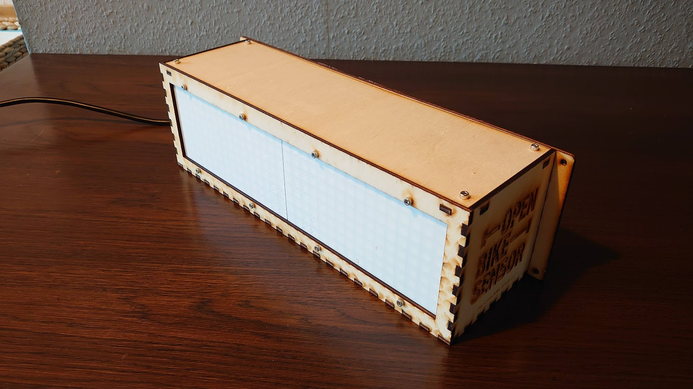
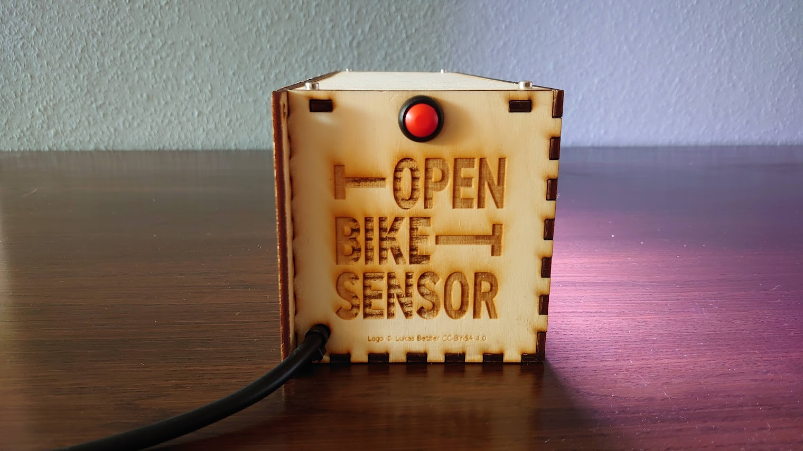

# OpenBikeSensor 8x32-neopixel-case

Files for a case that fits the 8x32 pixel WS2812B.

There are two variants - one for large printbeds and one for the smaller printbeds of typical consumer printers. Both can be generated by running ``make -j``, to switch between the two in the openscad file, the boolean variable ``small printbed`` can be adjusted.

The software which connects to an OpenBikeSensor via Bluetooth and shows the values on the display can be found [here](https://git.chaotikum.org/malte/openbikesensor-neopixel). 

Carefully choose a power supply, consider [this](https://www.reichelt.de/led-netzteil-40-w-5-v-dc-8-a-ip67-glp-gpv-60-5-p247116.html) if you can assure power consumption will not exceed 40W.

Build instructions (in german) can be found [here](https://md.dennis-boldt.de/e7RjfgLORk20s4eOPV2OUQ)

## The closed case

## The opened case

## The case in action 

